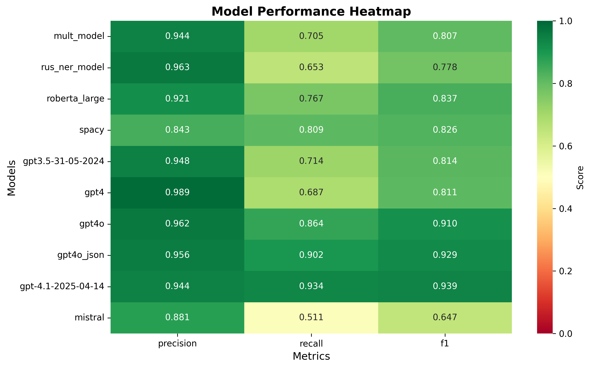

# 🎯 NER Models Evaluation for Russian Cultural Texts

This project provides **comprehensive evaluation and modular implementation** of Named Entity Recognition (NER) models for Russian cultural texts, comparing traditional NER approaches with modern LLM-based methods.

## 🚀 **Quick Start**

### **For NER Model Development:**
📔 **`NER_Models_Demo.ipynb`** - Interactive demonstration of the modular NER system

### **For Model Evaluation:**
📊 **`Evaluation_Analysis.ipynb`** - Comprehensive model comparison and analysis

### **For Production Use:**
🐍 **`model_comparison.py`** - Command-line evaluation script

## 📋 **Project Overview**

This project aims to compare the effectiveness of different Named Entity Recognition (NER) models in processing Russian cultural texts, providing both **live model inference** and **comprehensive evaluation frameworks**.

## Data

The dataset used for this project was created by parsing and cleaning raw text from electronic newsletters sent within [the SPbLitGuide (Saint Petersburg Literary Guide)](https://isvoe.ru/spblitgid/) project between 1999 and 2019. These newsletters detailed upcoming cultural events in St. Petersburg, providing a substantial source of information for analyzing the city's literary landscape over two decades. See the [Streamlit App](https://spblitguide.streamlit.app/) for the principles of word processing and a description of the data model.

- **Dataset Size**: 15,012 records
- **Attributes**: Event ID, event description, date/time, location, address, and geographic coordinates (latitude/longitude)
- **Annotations**: Person names labeled using Doccano text annotation framework
- **Annotated Sample Size**: 1000 records

## 🤖 **Available Models**

### **🏗️ Modular NER System** (`utils/ner_models/`)
Interactive model inference with unified interface:
- **🔤 spaCy**: Russian models (`ru_core_news_sm`, `ru_spacy_ru_updated`)
- **🤖 OpenAI**: GPT-4o, GPT-4, GPT-3.5-turbo (requires API key)
- **🧠 DeepPavlov**: BERT-based Russian NER (`ner_collection3_bert`, `ner_ontonotes_bert_mult`)

### **📊 Evaluated Models** (pre-computed predictions)
Traditional and LLM-based approaches compared in evaluation:
- **Traditional**: `mult_model`, `rus_ner_model`, `roberta_large`, `spacy`
- **LLM-based**: `gpt-3.5`, `gpt-4`, `gpt-4o`, `gpt4o_json`, `gpt-4.1`, `mistral`

## Evaluation

The models were evaluated based on their precision, recall, and F1 scores. Tokenizers from the respective models were used, resulting in different token counts for the same sample, highlighting the differences in tokenization approaches.

## Results

### Performance Overview



The evaluation results are summarized in the table below:

| Model           | Precision | Recall | F1 Score |
|-----------------|-----------|--------|----------|
| rus_ner_model   | 0.96      | 0.65   | 0.78     |
| mult_model      | 0.94      | 0.71   | 0.81     |
| roberta_large   | 0.92      | 0.77   | 0.84     |
| spacy           | 0.84      | 0.81   | 0.83     |
| gpt-3.5         | 0.95      | 0.71   | 0.81     |
| gpt-4           | 0.99      | 0.69   | 0.81     |
| gpt-4o          | 0.96      | 0.86   | 0.91     |
| gpt4o (json)    | 0.96      | 0.90   | 0.93     |
| gpt-4.1-2025-04-14 | 0.94      | 0.93   | 0.94     |

The evaluation results showed that:

- `gpt-4.1-2025-04-14` achieved the highest F1 Score of 0.94, making it the most balanced and accurate model.
- `gpt-4` had the highest precision (0.99), suitable for applications where minimizing false positives is critical.
- `roberta_large` and `spacy` provided balanced performance with high efficiency, making them reliable for general use.

## Statistical Significance

Statistical significance tests were performed between `gpt4o` and `gpt-4.1-2025-04-14`:

- **Precision**: Mean difference = -0.0180, 95% CI = [-0.0272, -0.0099], p-value = 1.0000
- **Recall**: Mean difference = 0.0702, 95% CI = [0.0438, 0.0971], p-value = 0.0000
- **F1**: Mean difference = 0.0289, 95% CI = [0.0138, 0.0440], p-value = 0.0000

## Citation

If you use this repository in your research, please cite it as follows:

```bibtex
@misc{lev2024ner,
  author = {Maria Levchenko},
  title = {Evaluation of Named Entity Recognition Models for Russian News Texts in the Cultural Domain},
  year = {2024},
  howpublished = {\url{https://github.com/mary-lev/NER}},
  note = {Accessed: 2024-06-01}
}